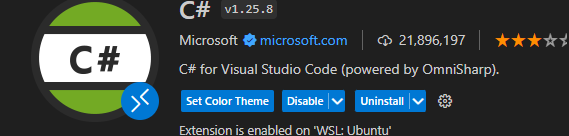

# 配置C#环境
### 安装vscode扩展


### 安装 .NET SDK 或 .NET Runtime
.NET runtime = Common Language Runtime = CLR

* [.NET下载](https://dotnet.microsoft.com/zh-cn/download)

* [脚本安装](https://learn.microsoft.com/en-us/dotnet/core/install/linux-scripted-manual#scripted-install)

* [Set environment variables system-wide](https://learn.microsoft.com/en-us/dotnet/core/install/linux-scripted-manual#set-environment-variables-system-wide)

* [配置TAB补全](https://learn.microsoft.com/en-us/dotnet/core/tools/enable-tab-autocomplete)

# Tutorial: Create a .NET console application using Visual Studio Code
* [Create a console app](https://learn.microsoft.com/en-us/dotnet/core/tutorials/with-visual-studio-code?pivots=dotnet-8-0)

```bash
dotnet new console
dotnet new console --framework net8.0 --use-program-main
```
> --use-program-main: Use it to create a console project that doesn't use top-level statements and has Main method